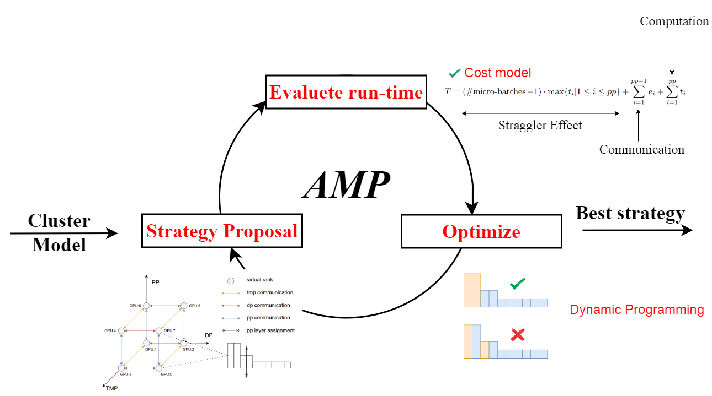
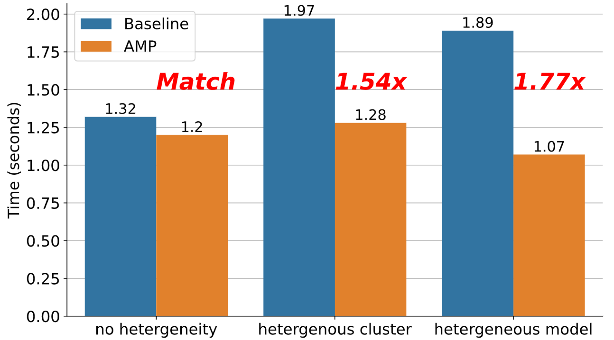
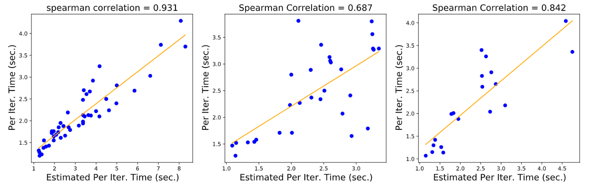

# AMP: Automatically Finding Model Parallel Strategies with Heterogeneity Awareness (NeurIPS 2022) 
[**Paper**](https://arxiv.org/pdf/2210.07297.pdf) | 
[**Usage**](#usage) |
[**Citation**](#citation) |
[**Presentation**](https://recorder-v3.slideslive.com/?share=74667&s=aa9ce793-0697-43bc-9d8f-f7b139471f95) 

This repository contains the official code for our NeurIPS 2022 paper **AMP**. AMP is an **automatic** approach to find fast model-parallel strategies to train large Deep Learning models. We design AMP to tackle real-world scnerios where users are training **hetergeneous** models with uneven layers and **hetergeneous** cluster with mixed generations of GPUs. Concretely, it contributes (1) a valid representation space of model-parallelism strategies, (2) a cost model that can accurately predict the running time of a strategy without launching expensive real trials, and (3) An optimization procedure that uses the cost model to find fast strategies. A dynamic programming approach is included to do this efficiently. 



## Performance 
AMP finds strategies that have similar performance to the state-of-the-art strategy finder[[1]](#1) when no heterogeneity in the model and in the cluster. AMP fins strategies that are **1.54x** better than the SOTA when heterogeneity exists in the cluster, and **1.77x** better when heterogeneity exists in the model. In particular, our cost model can accurately predict low costs for top strategies. 

 

## Usage
We provide two settings: (1) use AMP to predict top strategies, (2) Additionally launch real trials with DeepSpeed to validate the ground truth runtime. Setting 1 requires a single CPU, while Setting 2 requires 16 GPUs in AWS EC2 (we provide the instance details in the paper). We have installed the environment and prepare necessary intermediate results for Setting 2 in an [AMI](ami-09f6a8b4410998129) for ease of setup.

#### Set up environment for setting 1
````
cd ~
git clone https://github.com/MccRee17/AMP
conda create -n amp python=3.7.3
conda activate amp
conda install numpy ninja pyyaml mkl mkl-include setuptools cmake cffi typing_extensions future six requests
pip install tqdm spur torch==1.7.1+cu110 torchvision==0.8.2+cu110 -f https://download.pytorch.org/whl/torch_stable.html
````

#### Set up environment for setting 2
Use our AMI to launch correponding instances (details in paper) and within the **same** placement group using the **cluster** strategy in EC2. This will place all instances in the same area and thus have the maximum bandwidth. Then add the IPs of each machine in ``~/hostfile`` and state the number of machines in each node ([Reference](https://www.deepspeed.ai/getting-started/)). For instance, all 4x4 clusters in the paper are specified by: 
````
IP1 slots=4
IP2 slots=4
IP3 slots=4
IP4 slots=4
````
Suggestions: (1) Warm up each AWS machine before running, otherwise trials may get terminated by timeout. (2) If some configurations hang, one can manually login to each machine and kill GPU processes to continue the searching algorithm (which is run on CPU). A useful command to check processes on GPU: sudo fuser -v /dev/nvidia*. (3) If processes constantly get stuck, try removing all caches by ``rm -rf ~/amp_simulate; rm -rf ~/tmp``. If there are other blockers in launching distributed experiments, please leave an issue here or send Dacheng an [email](dacheng2@andrew.cmu.edu).

### Experiment 1: Homogeneous
With Setting 1:
````
cd AMP/src
python homogeneous.py 
````
This will finish in around 500 seconds and store the result in ~/amp_main_logs/homogeneous_[time_stamp].txt.

With Setting 2:
```` 
cd AMP/DeepSpeed/DeepSpeedExamples/Megatron-LM-v1.1.5-3D_parallelism
python homogeneous.py --full --budget 10
````
This will run the prediction and launch top 10 predicted strategies. It will finish in around 1500 seconds and store the result in ~/amp_main_logs/homogeneous_[time_stamp].txt. To run x numbers of real trials, use argument --budget x. The raw log from our modified DeepSpeed contains a lot of details such as the pipeline schedule, we recommend piping it into another log.txt for further interpretation.

Cached results with 53 real trials are in AMP/src/results/homogeneous_results.txt and logs in AMP/src/results/homogeneous_log.txt.

#### Experiment 2: Hetergeneous cluster
With Setting 1:
````
cd AMP/src
python het_cluster.py 
````

With Setting 2:
```` 
cd AMP/DeepSpeed/DeepSpeedExamples/Megatron-LM-v1.1.5-3D_parallelism
python het_cluster.py --full --budget 10
````
This will finish in around 500 seconds and store the result in ~/amp_main_logs/het_cluster_[time_stamp].txt.

Cached results with 53 real trials are in AMP/src/results/het_cluster_results.txt and logs in AMP/src/results/het_cluster_log.txt.

### Experiment 3: Hetergeneous model
With Setting 1:
````
cd AMP/src
python het_model.py 
````

With Setting 2:
```` 
cd AMP/DeepSpeed/DeepSpeedExamples/Megatron-LM-v1.1.5-3D_parallelism
python het_model.py --full --budget 10
````
This will finish in around 200 seconds and store the result in ~/amp_main_logs/het_model_[time_stamp].txt.

Cached results with 65 real trials are in AMP/src/results/het_model_results.txt and logs in AMP/src/results/het_model_log.txt.

## Code Logic
Basic logic of AMP is implemented in several files:
- The main function (homogeneous.py, het_cluster.py, het_model.py) that iteratively applies the cost model and selects the best ones to launch real trials.
- cost_xxx.py that implements the cost model. (We are in the process to reproduce the SA ablation study, please ignore the mp_avg variable.)
- pipe.py that implements the dynamic programming algorithm.
- sa.py that gives possible candidates for the main function to loop. 
- amp_utils.py that implements other functions such as launching real trials with given configurations.

## Citation
If you find this repository useful, please cite our paper using
````
@article{li2022amp,
  title={AMP: Automatically Finding Model Parallel Strategies with Heterogeneity Awareness},
  author={Li, Dacheng and Wang, Hongyi and Xing, Eric and Zhang, Hao},
  journal={arXiv preprint arXiv:2210.07297},
  year={2022}
}
````
## References
<a id="1">[1]</a> 
Narayanan, Deepak, et al. "Efficient large-scale language model training on gpu clusters using megatron-lm." Proceedings of the International Conference for High Performance Computing, Networking, Storage and Analysis. 2021.
